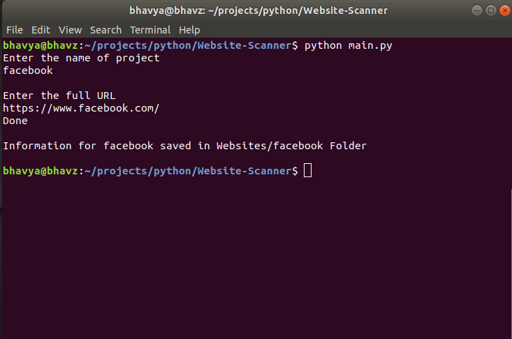

# web-fetch
A Python mini-project used to acess a Website and extract useful information of it. 

# Description

## Steps to run 

1. Through terminal Run main.py
2. Type the website folder you want to create (it will automatically create a folder in which details of website will be stored)
3. Type the complete URL of the website of which details have to be fetched.

# Inside the specific website folder 

## 3 files

### 1. nmap.txt
Nmap uses raw IP packets in novel ways to determine what hosts are available on the network, what services (application name and version) those hosts are offering, what operating systems (and OS versions) they are running, what type of packet filters/firewalls are in use, and dozens of other characteristics.

### 2. robots-txt.txt
Robots-txt.txt file specifies whether certain user agents can or cannot access parts of a website. Some parts of the website are locked and some are unlocked which can be identified by reading Allow and Disallow options in the file.

### 3. whois.txt
Gives the complete details of the website like the Admin's and Registrant's details etc.
